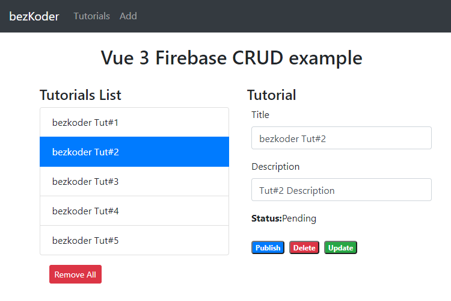

# Vue 3 Firebase example: CRUD with Realtime Database

Build a Vue.js 3 Firebase CRUD example with Realtime Database, display and modify data using Axios and Vue Router.
- Each Tutorial has id, title, description, published status.
- We can create, retrieve, update, delete Tutorials.



For instruction, please visit:
> [Vue 3 Firebase example: CRUD with Realtime Database](https://www.bezkoder.com/vue-3-firebase/)

More Practice:
> [Vue Firestore example: Buid CRUD App](https://www.bezkoder.com/vue-3-firestore/)

> [Vue CRUD example with Axios and Vue Router](https://www.bezkoder.com/vue-3-crud/)

> [Vue Typescript example with Axios: Build CRUD App](https://www.bezkoder.com/vue-3-typescript-axios/)

> [Vue JWT Authentication and Authorization with Vuex and Vue Router](https://www.bezkoder.com/vue-3-authentication-jwt/)

> [Vue Pagination with Axios and API example](https://www.bezkoder.com/vue-pagination-axios/)

> [Vue File Upload example using Axios](https://www.bezkoder.com/vue-axios-file-upload/)

Fullstack with Node.js Express:
> [Vue.js + Node.js Express + MySQL](https://www.bezkoder.com/vue-js-node-js-express-mysql-crud-example/)

> [Vue.js + Node.js Express + PostgreSQL](https://www.bezkoder.com/vue-node-express-postgresql/)

> [Vue.js + Node.js Express + MongoDB](https://www.bezkoder.com/vue-node-express-mongodb-mevn-crud/)

Fullstack with Spring Boot:
> [Vue.js + Spring Boot](https://www.bezkoder.com/spring-boot-vue-js-crud-example/)

> [Vue.js + Spring Boot + MongoDB](https://www.bezkoder.com/spring-boot-vue-mongodb/)

Fullstack with Django:
> [Vue.js + Django](https://www.bezkoder.com/django-vue-js-rest-framework/)

Integration (run back-end & front-end on same server/port)
> [Integrate Vue.js with Spring Boot](https://www.bezkoder.com/integrate-vue-spring-boot/)

> [Integrate Vue App with Node.js Express](https://www.bezkoder.com/serve-vue-app-express/)

## Project setup
```
npm install
```

### Compiles and hot-reloads for development
```
npm run serve
```

### Compiles and minifies for production
```
npm run build
```

### Lints and fixes files
```
npm run lint
```

### Customize configuration
See [Configuration Reference](https://cli.vuejs.org/config/).
